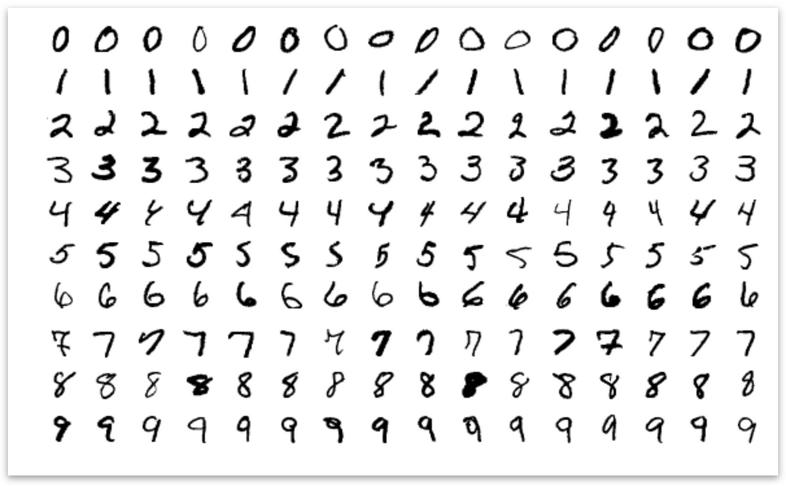
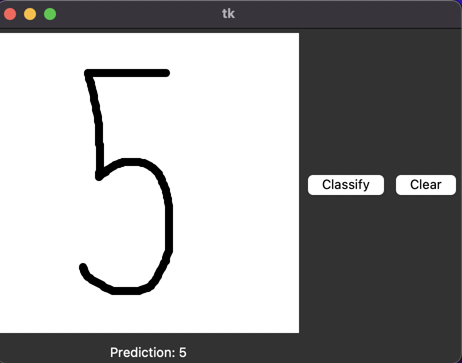
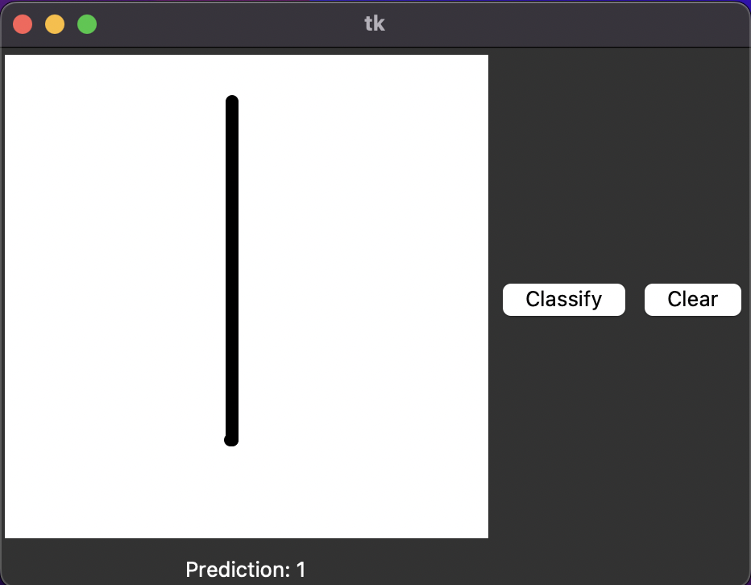
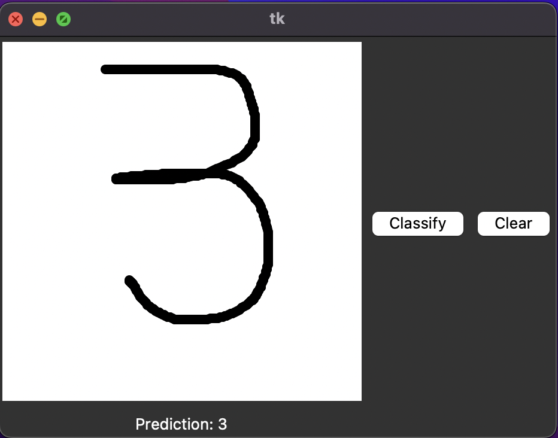
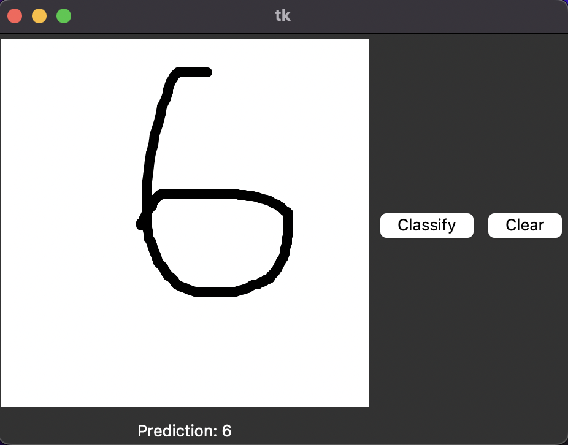

# Handwritten Digit Classification using PyTorch

This repository contains a simple implementation of a neural network to classify handwritten digits using the MNIST dataset. The neural network is built and trained using PyTorch.

## Project Description
https://medium.com/@bennachmanson/handwritten-digit-classification-using-convolution-neural-networks-cnn-in-pytorch-3154e15b378c

This project employs the widely-used MNIST dataset, composed of grayscale images of handwritten digits (0-9), each measuring 28x28 pixels. The objective is to correctly classify these images based on the digit they represent.

I've developed a user-friendly graphical user interface (GUI) that enables users to sketch digits. The program then uses the sketched digit as input to the trained model, which predicts the digit the user intended to draw.

The predictive model behind the scenes is a straightforward feedforward neural network with two hidden layers. The network has been trained and implemented using PyTorch, leveraging its efficient tensor computations and automatic differentiation functionalities. This simplifies the development process while ensuring optimal performance.

Through this project, users can directly interact with the model, providing a more intuitive understanding of the application of neural networks in image classification tasks.

## Dependencies

* Python 3.8
* PyTorch 1.9.0
* Torchvision
* NumPy
* Matplotlib

You can install the dependencies like this:

pip install torch torchvision numpy matplotlib

## Usage

1. Clone this repository to your local machine.
2. Install the necessary dependencies.
3. Run the Jupyter notebook.

## Results

The trained model achieves an accuracy of 95% on the MNIST test set. I've have also developed a graphical user interface (GUI) that allows users to sketch digits. The program then uses the sketch as input for a trained model, which predicts the digit the user intended to draw.

<table>
  <tr>
    <td align="center"></td>
    <td align="center"></td>
  </tr>
  <tr>
    <td align="center"></td>
    <td align="center"></td>
  </tr>
</table>

## License

This project is licensed under the terms of the MIT license.

## Contact

For any queries, feel free to reach out to me here
